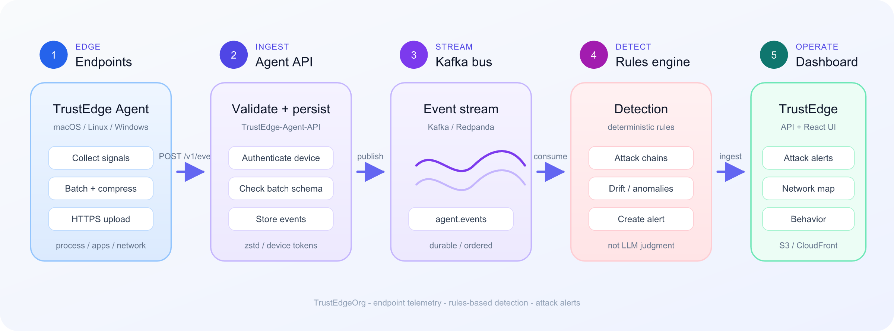

#  TrustEdge

**Self-hosted security observability** — endpoint telemetry, rules-based detection, and attack alerts.

React dashboard · FastAPI control plane · [TrustEdge Agent](https://github.com/TrustEdgeOrg/TrustEdge-Agent) · [Agent API](https://github.com/TrustEdgeOrg/TrustEdge-Agent-API) · AWS deploy with CI/CD.

[](https://github.com/TrustEdgeOrg/TrustEdge/actions/workflows/deploy-develop.yml)

---

## About the project

TrustEdge is a **self-hosted security observability platform** for teams that want real endpoint signal and actionable detection without a heavy enterprise EDR stack.

A lightweight [TrustEdge Agent](https://github.com/TrustEdgeOrg/TrustEdge-Agent) runs on macOS, Linux, and Windows. It collects process, app-focus, and network-posture telemetry, batches and compresses it, then uploads over HTTPS to [TrustEdge-Agent-API](https://github.com/TrustEdgeOrg/TrustEdge-Agent-API). Events flow onto Kafka, a rules engine looks for attack chains and drift, and this control plane surfaces **attack alerts**, maps, and behavior views in a React dashboard.

Detection stays **rules-based** (deterministic). Optional LLMs only help explain state to operators — they do not decide what is malicious.

<p align="center">
  
</p>

---

## Architecture

TrustEdge separates **collection** (on the endpoint), **ingest + detection** (Agent API → Kafka → rules engine), and **operator views** (FastAPI + React).

<p align="center">
  
</p>

| Stage | Components | Responsibility |
|-------|------------|----------------|
| **1 · Edge** | TrustEdge Agent | Collect · batch · compress · HTTPS upload |
| **2 · Ingest** | [TrustEdge-Agent-API](https://github.com/TrustEdgeOrg/TrustEdge-Agent-API) | Auth · validate · persist · publish |
| **3 · Stream** | Kafka / Redpanda | Durable `agent.events` bus |
| **4 · Detect** | `detection-engine` | Attack / drift rules → alerts |
| **5 · Operate** | FastAPI · Security Graph · React dashboard | Alerts, graph, maps, behavior |
| **Data** | PostgreSQL (RDS), Redis | Source of truth · live state |

More detail: [docs/SYSTEM_ARCHITECTURE.md](docs/SYSTEM_ARCHITECTURE.md)

---

## How it works

1. **Endpoint** — device running TrustEdge Agent  
2. **Collector → Batch → Compress** — on-device telemetry pipeline  
3. **Secure upload** — HTTPS to Agent API  
4. **Agent API → Stream** — validate, persist, publish  
5. **Detection → Alert** — rules engine + dashboard  

---

## Platform at a glance

| Capability | Implementation |
|------------|----------------|
| Endpoint telemetry | Process, app focus, network posture |
| Detection | Kafka-backed rules on agent events |
| Observability | Attack alerts, network map, behavior drift |
| AI operations | Optional summaries (OpenAI / Ollama / template) |
| Production ops | CloudWatch JSON logs, Alembic, ECR deploy |

---

## Tech stack

| Area | Technologies |
|------|----------------|
| Frontend | React 19, TypeScript, Material UI 7 |
| Backend | Python 3.11, FastAPI, SQLAlchemy 2, Alembic |
| Endpoint agent | Go ([TrustEdge-Agent](https://github.com/TrustEdgeOrg/TrustEdge-Agent)) |
| Streaming | Kafka / Redpanda, Redis |
| Data | PostgreSQL 16 (RDS) |
| Infrastructure | AWS EC2, S3, CloudFront, ECR |
| CI/CD | GitHub Actions, Docker Compose |

---

## Quick start

```bash
git clone https://github.com/TrustEdgeOrg/TrustEdge.git
cd TrustEdge
```

- Deploy: [docs/DEPLOY.md](docs/DEPLOY.md)  
- Environment: [docs/ENV_SETUP.md](docs/ENV_SETUP.md)  
- Agent: [TrustEdge-Agent](https://github.com/TrustEdgeOrg/TrustEdge-Agent)  
- Ingest API: [TrustEdge-Agent-API](https://github.com/TrustEdgeOrg/TrustEdge-Agent-API)  

---

## Documentation

| Document | Description |
|----------|-------------|
| [docs/README.md](docs/README.md) | Documentation index |
| [docs/SYSTEM_ARCHITECTURE.md](docs/SYSTEM_ARCHITECTURE.md) | Components and data flows |
| [docs/API.md](docs/API.md) | REST reference |
| [docs/ENV_SETUP.md](docs/ENV_SETUP.md) | Environment variables |
| [docs/DEPLOY.md](docs/DEPLOY.md) | AWS production deploy |

---

## Ecosystem

| Repository | Role |
|------------|------|
| **[TrustEdge](https://github.com/TrustEdgeOrg/TrustEdge)** | This control plane |
| **[TrustEdge-Agent](https://github.com/TrustEdgeOrg/TrustEdge-Agent)** | Endpoint collector |
| **[TrustEdge-Agent-API](https://github.com/TrustEdgeOrg/TrustEdge-Agent-API)** | Ingest · validate · Kafka |

---

Part of [TrustEdgeOrg](https://github.com/TrustEdgeOrg) · Portfolio and educational use.
