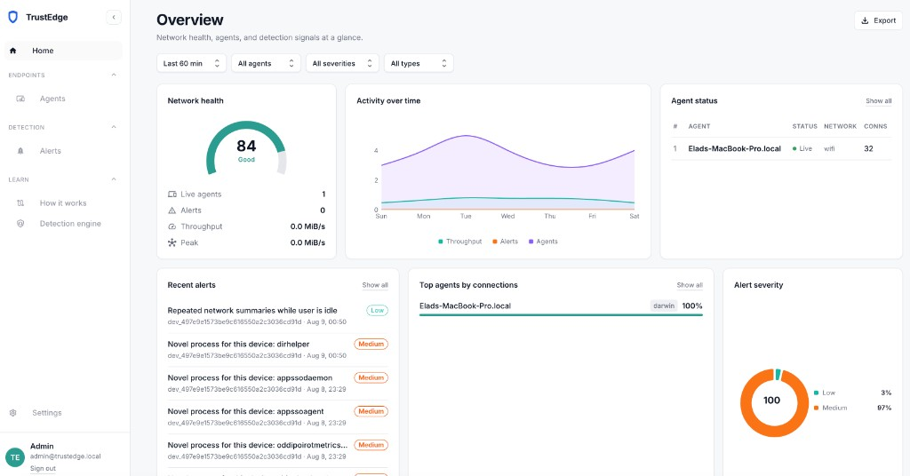
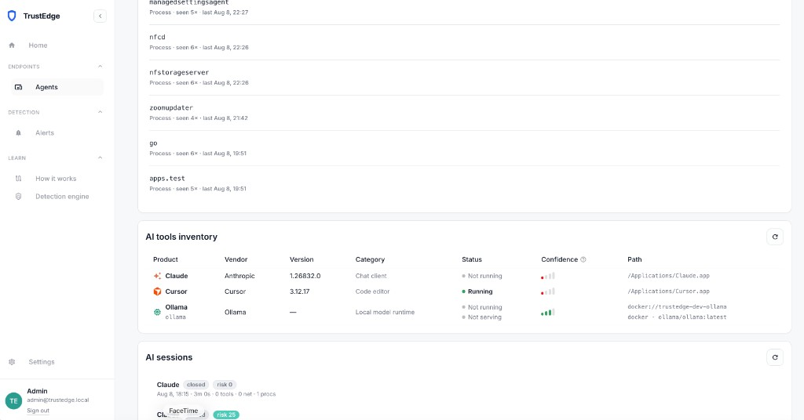
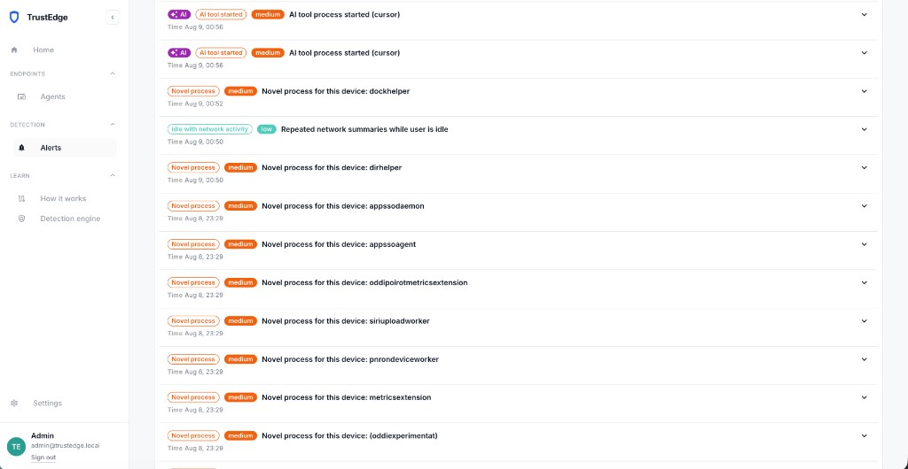
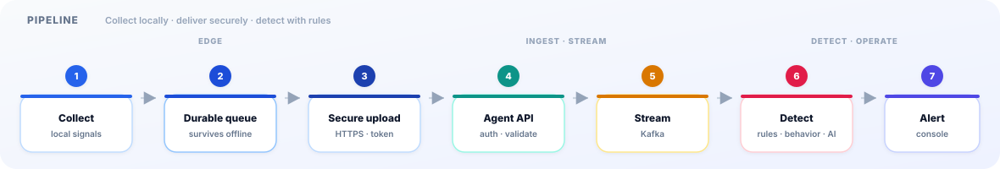
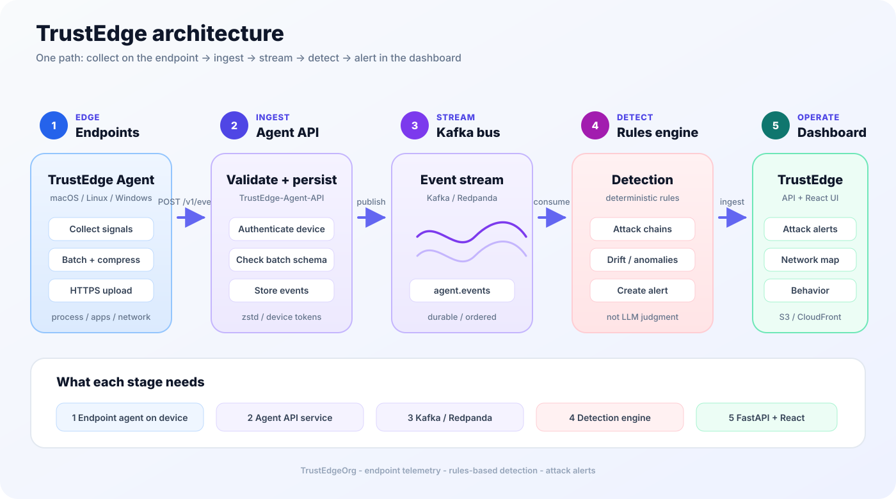
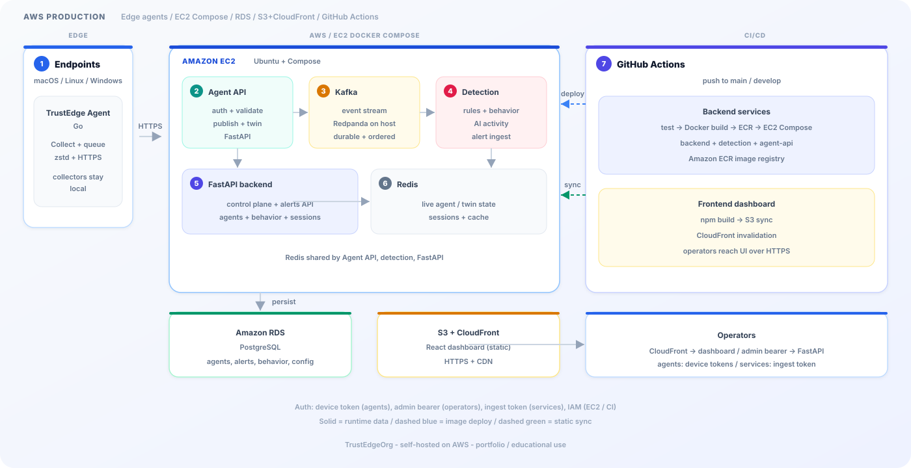

#  TrustEdge

**Self-hosted security observability** — endpoint telemetry, multi-engine detection, and attack alerts.

React dashboard · FastAPI control plane · [TrustEdge Agent](https://github.com/TrustEdgeOrg/TrustEdge-Agent) · [Agent API](https://github.com/TrustEdgeOrg/TrustEdge-Agent-API) · AWS deploy with CI/CD.

[](https://github.com/TrustEdgeOrg/TrustEdge/actions/workflows/deploy-develop.yml)

---

## About the project

TrustEdge is a **self-hosted security observability platform**. It gives teams real endpoint signal and actionable detection without a heavyweight enterprise EDR stack.

A lightweight [TrustEdge Agent](https://github.com/TrustEdgeOrg/TrustEdge-Agent) runs on macOS, Linux, and Windows. It collects process, activity, network (summary + connection samples), security-lifecycle, and AI tools inventory telemetry. Events go into a durable local queue, then are compressed (**zstd**) and uploaded over HTTPS to [TrustEdge-Agent-API](https://github.com/TrustEdgeOrg/TrustEdge-Agent-API).

Kafka streams those events into detection. This control plane surfaces **attack alerts**, the **agents** registry, **AI tools inventory**, **behavior** baselines, and **AI activity sessions** in a React dashboard.

Detection is multi-engine and deterministic:

- **YAML attack/chain rules** — process, network, and security lifecycle patterns  
- **Behavioral engine** — per-device baselines and novel-process alerts  
- **AI activity engine** — agentic session reconstruction and AI-tool findings  

Optional LLMs (**Ollama** / OpenAI / templates) can **explain** alerts and summarize network state — they never decide what is malicious.

---

## Screenshots

### Overview

<p align="center">
  
</p>

<p align="center"><em>Network health, live agents, recent alerts, and severity at a glance.</em></p>

### Agent detail

<p align="center">
  
</p>

<p align="center"><em>Behavior baseline, AI tools inventory, and AI sessions on a single endpoint.</em></p>

### Alerts

<p align="center">
  
</p>

<p align="center"><em>AI tool starts, novel processes, and idle network activity — with expandable evidence.</em></p>

| Surface | What you get |
|---------|--------------|
| **Home** | Health, recent alerts, agent status, AI network overview |
| **Agents** | Registry + per-agent twin, timeline, AI tools inventory, behavior, AI sessions |
| **Alerts** | Filters, process chain/graph evidence, **Explain with Ollama** |
| **Learn** | How it works · Detection engine |

---

## Architecture

TrustEdge separates **collection** on the endpoint, **ingest and detection** in the stream path, and **operator views** in FastAPI + React.

<p align="center">
  
</p>

<p align="center">
  
</p>

| Stage | Components | Responsibility |
|-------|------------|----------------|
| **1 · Edge** | TrustEdge Agent (Go) | Collect · durable queue · zstd · HTTPS |
| **2 · Ingest** | [TrustEdge-Agent-API](https://github.com/TrustEdgeOrg/TrustEdge-Agent-API) (FastAPI) | Device auth · validate · publish · live twin |
| **3 · Stream** | Kafka / Redpanda | Durable `trustedge.agent.events` bus |
| **4 · Detect** | `detection-engine` | Rules · behavior / novelty · AI activity → alerts |
| **5 · Operate** | FastAPI · React dashboard | Alerts, agents, AI inventory, behavior, sessions |
| **Data** | PostgreSQL (RDS), Redis | Source of truth · live twin state |

More detail: [docs/SYSTEM_ARCHITECTURE.md](docs/SYSTEM_ARCHITECTURE.md)

---

##  Production on AWS

Self-hosted on **EC2 + Docker Compose**, with **RDS**, **S3 + CloudFront**, **ECR**, and **GitHub Actions** CI/CD.

<p align="center">
  
</p>

| Layer | What runs there |
|-------|-----------------|
| **EC2 (Compose)** | Agent API · Kafka/Redpanda · detection-engine · FastAPI · Redis |
| **RDS** | PostgreSQL — agents, alerts, behavior, config |
| **S3 + CloudFront** | React dashboard (static) + HTTPS |
| **ECR + Actions** | Image build/push · EC2 deploy · frontend sync |

Deploy guide: [docs/DEPLOY.md](docs/DEPLOY.md)

---

## How it works

1. **Endpoint** — TrustEdge Agent runs on the device  
2. **Collect → durable queue → compress** — local telemetry (including AI tools inventory)  
3. **Secure upload** — HTTPS to Agent API with a device token  
4. **Ingest → stream** — validate and publish to Kafka  
5. **Detect → operate** — rules, behavior, and AI activity create alerts; the dashboard shows them  

Optional LLMs explain alerts — they never decide what is malicious.

---

## Platform at a glance

| Capability | Implementation |
|------------|----------------|
| Endpoint telemetry | Process, activity, network summary + connections, security lifecycle, AI tools |
| Reliable delivery | Durable queue · zstd · HTTPS · retry with backoff |
| Detection | YAML rules · behavior baselines / novelty · AI activity sessions |
| Observability | Alerts · agents · AI inventory · behavior · AI sessions · twin |
| Operator assist | Optional Ollama / OpenAI / template explain & overview |
| Production ops | EC2 + Docker Compose, RDS, S3/CloudFront, ECR, GitHub Actions |

---

## Tech stack

| Area | Technologies |
|------|----------------|
| Frontend | React 19, TypeScript, Material UI 7 |
| Backend | Python 3.11, FastAPI, SQLAlchemy 2, Alembic |
| Endpoint agent | Go ([TrustEdge-Agent](https://github.com/TrustEdgeOrg/TrustEdge-Agent)) |
| Streaming | Kafka / Redpanda, Redis |
| Data | PostgreSQL 16 (RDS) |
| Infrastructure | AWS EC2, S3, CloudFront, ECR |
| CI/CD | GitHub Actions, Docker Compose |

---

## Quick start

```bash
git clone https://github.com/TrustEdgeOrg/TrustEdge.git
cd TrustEdge
```

- Deploy: [docs/DEPLOY.md](docs/DEPLOY.md)  
- Environment: [docs/ENV_SETUP.md](docs/ENV_SETUP.md)  
- Agent: [TrustEdge-Agent](https://github.com/TrustEdgeOrg/TrustEdge-Agent)  
- Ingest API: [TrustEdge-Agent-API](https://github.com/TrustEdgeOrg/TrustEdge-Agent-API)  

---

## Documentation

| Document | Description |
|----------|-------------|
| [docs/README.md](docs/README.md) | Documentation index |
| [docs/SYSTEM_ARCHITECTURE.md](docs/SYSTEM_ARCHITECTURE.md) | Components and data flows |
| [docs/API.md](docs/API.md) | REST reference |
| [docs/ENV_SETUP.md](docs/ENV_SETUP.md) | Environment variables |
| [docs/DEPLOY.md](docs/DEPLOY.md) | AWS production deploy |

---

## Ecosystem

| Repository | Role |
|------------|------|
| **[TrustEdge](https://github.com/TrustEdgeOrg/TrustEdge)** | This control plane |
| **[TrustEdge-Agent](https://github.com/TrustEdgeOrg/TrustEdge-Agent)** | Endpoint collector |
| **[TrustEdge-Agent-API](https://github.com/TrustEdgeOrg/TrustEdge-Agent-API)** | Ingest · validate · Kafka · twin |

---

Part of [TrustEdgeOrg](https://github.com/TrustEdgeOrg) · Portfolio and educational use.
