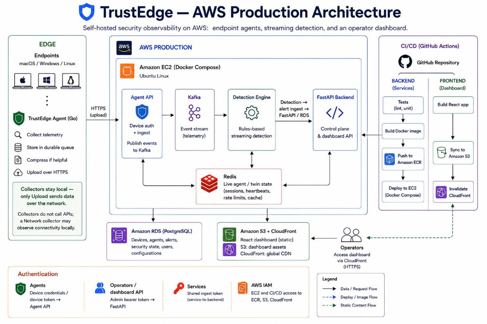

#  System architecture

Component topology and data flows for TrustEdge: endpoint telemetry from TrustEdge Agent, rules-based detection, and attack alerts in the operator dashboard. For design principles and implementation patterns, see [DESIGN.md](DESIGN.md).

---

##  Architecture diagram

<p align="center">
  
</p>

**Primary path:** Agent → HTTPS upload → Agent API → Kafka → detection-engine → alert ingest → FastAPI → React dashboard.

---

##  AWS production

<p align="center">
  
</p>

Deploy and host layout: [DEPLOY.md](DEPLOY.md)

---

##  Component overview

| Layer | Components | Role |
|-------|------------|------|
| **Endpoint agents** | TrustEdge Agent (`trustedge-agent`) | Process, activity, network, security lifecycle, and AI tools inventory |
| **Docker on EC2** | FastAPI backend, detection-engine, trustedge-agent-api | APIs, alerts, ingest, rules |
| **AWS** | RDS PostgreSQL, S3, CloudFront, ECR | Persistent state, dashboard hosting, images |
| **Redis** | Live agent / twin keys on EC2 | Live posture and helpers |
| **Kafka / Redpanda** | `trustedge.agent.events` | Detection-engine input stream |

---

##  Data flows

### Endpoint telemetry path

```
TrustEdge Agent → POST /v1/events → trustedge-agent-api → Kafka (trustedge.agent.events)
                 → detection-engine → POST /security/alerts/ingest → Backend
                 → Agent-API upsert → Postgres agents registry → dashboard Agents
```

### L4 flow ingest (optional)

```
Host conntrack watcher → POST /network-flows/bulk → Backend Redis window → GET /network-flows/live
```

---

##  Trust boundaries

| Boundary | Why it exists |
|----------|---------------|
| **CloudFront ↔ Backend** | HTTPS termination; API proxied to EC2 :8000 |
| **Token scopes** | Admin, ingest, and device tokens protect different surfaces |

Details: [DESIGN.md § Security model](DESIGN.md#security-model).

---

##  Related docs

- [DESIGN.md](DESIGN.md) — full design guide
- [ENV_SETUP.md](ENV_SETUP.md) — configuration
- [CLOUDWATCH_LOGGING.md](CLOUDWATCH_LOGGING.md) — operational logging
